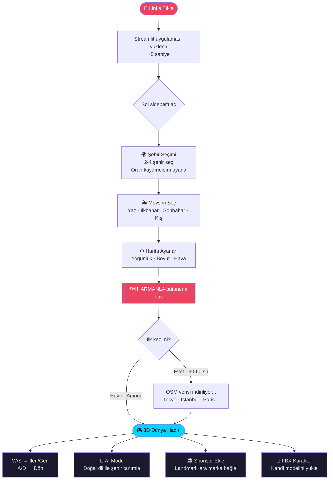

# 🌆 HARMAN — City Blend Engine

**Gerçek dünya şehirlerini harmanlayarak oynanabilir 3D oyun haritaları üret.**

[](https://harman-4n2pw2i72onbrktrkm38cm.streamlit.app)
[](https://python.org)
[](https://streamlit.io)
[](https://threejs.org)
[](LICENSE)

> 🎮 **[→ Hemen Dene: harman.streamlit.app](https://harman-4n2pw2i72onbrktrkm38cm.streamlit.app)**

---

## 🗺️ Nasıl Kullanılır?



### ⚡ Hızlı Başlangıç (30 saniye)

| Adım | Açıklama |
|------|----------|
| **1** | [Linke tıkla](https://harman-4n2pw2i72onbrktrkm38cm.streamlit.app) — tarayıcıda açılır |
| **2** | Sol sidebar → **Şehir 1** ve **Şehir 2** seç (örn: Tokyo + İstanbul) |
| **3** | **Veri Kaynağı** → `OSM Gerçek Veri` seç |
| **4** | 🗺️ **HARMANLA** butonuna bas |
| **5** | Harita yüklenince **W/S/A/D** ile yürü |

> ⏱️ **İlk yükleme:** OpenStreetMap verisi indirilirken 30-60 saniye bekleyebilir.  
> ⚡ **Sonraki açılışlar:** Önbellekten anında yüklenir.

---

## ✨ Özellikler

- **6 Şehir** — Tokyo · İstanbul · Paris · New York · Dubai · Londra
- **OSM Gerçek Veri** — OpenStreetMap'ten gerçek bina ölçüleri, sokak ağı, landmark'lar
- **Zone Bazlı Harmanlama** — Voronoi bölgeleri, Voronoi yumuşaklık kontrolü
- **4 Mevsim** — Yaz · İlkbahar · Sonbahar · Kış (kar, çimen, kuru yaprak)
- **Procedural Dokular** — Tuğla · Kireçtaşı · Cam panel · Beton (canvas tabanlı, harici dosya yok)
- **Landmark Sistemi** — Gerçek OSM POI'lar + sponsor billboard sistemi
- **Çarpışma Tespiti** — AABB + slide-along-wall
- **FBX Karakter** — Kendi modelini yükle, animasyonlar desteklenir
- **Claude AI** — Doğal dil ile şehir tanımı, dünya loru, sponsor önerisi
- **Ağaçlar & Nehir** — Zone'a özgü ağaç türleri, animasyonlu su

---

## 🚀 Kurulum

```bash
# 1. Repoyu klonla
git clone https://github.com/KULLANICI/harman.git
cd harman

# 2. Bağımlılıkları kur
pip install -r requirements.txt

# 3. Uygulamayı başlat
streamlit run app.py
```

> **Not:** OSM verisi ilk çalıştırmada otomatik indirilir ve `data/cache/` klasörüne kaydedilir.

---

## ⚙️ Yapılandırma

### Claude AI (opsiyonel)
`.streamlit/secrets.toml` dosyası oluştur:
```toml
ANTHROPIC_API_KEY = "sk-ant-..."
```

Ya da uygulama içinde sidebar'dan API key girilebilir.

---

## 📁 Proje Yapısı

```
harman/
├── app.py                  # Ana Streamlit uygulaması
├── requirements.txt        # Python bağımlılıkları
├── data/
│   ├── osm_fetcher.py      # OpenStreetMap veri çekici
│   ├── landmark_fetcher.py # POI / landmark verisi
│   └── cache/              # OSM önbelleği (git'e dahil değil)
├── engine/
│   ├── blend_engine.py     # Şehir harmanlama motoru
│   ├── zone_engine.py      # Voronoi bölge sistemi
│   ├── terrain_engine.py   # Arazi parametreleri
│   └── landmark_engine.py  # Landmark yerleştirme
└── ai/
    └── harman_ai.py        # Claude API entegrasyonu
```

---

## 🗺️ Sprint Yol Haritası

| Sprint | İçerik | Durum |
|--------|--------|-------|
| 1 | UI + Şehir Seçimi + Three.js Temel | ✅ |
| 2 | OSM Gerçek Veri + Procedural Dokular | ✅ |
| 3 | Zone Motoru + Sokaklar + Arazi | ✅ |
| 4 | Landmark + Sponsor Sistemi | ✅ |
| 5 | Claude AI Entegrasyonu | ✅ |
| 6 | FBX Karakter + Animasyon | ✅ |
| 7 | Mevsim + Atmosfer + Çarpışma | ✅ |
| 8 | GLB Export | 🔜 |
| 9 | Gece/Gündüz Döngüsü | 🔜 |
| 10 | Sponsor Dashboard | 🔜 |

---

## 🛠️ Geliştirilen Teknolojiler

- **Frontend:** Three.js r128, Streamlit
- **Backend:** Python, OSMnx, GeoPandas
- **AI:** Anthropic Claude API (claude-opus-4-8)
- **Veri:** OpenStreetMap, Overpass API

---

## 📄 Lisans

MIT License — Detaylar için [LICENSE](LICENSE) dosyasına bakın.
